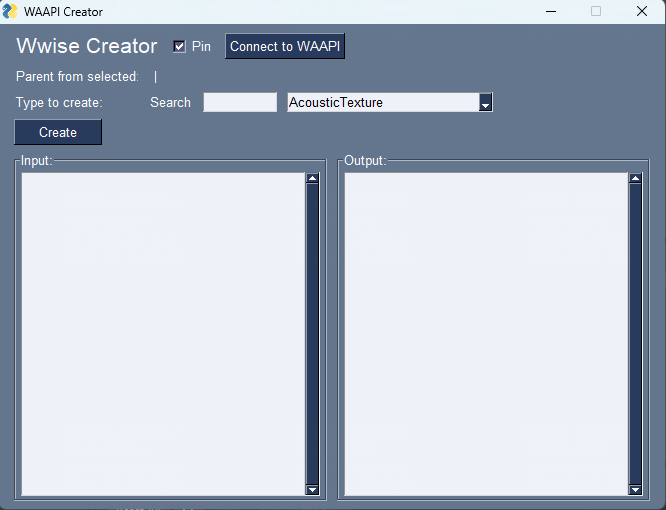

# WAAPI Creator

一个用来创建wwise对象的工具。

## 使用方法：

1. 启用WAAPI。
2. 运行 waapi_creator.exe。
3. 点击 wwise 工程结构选择对象作为要创建对象的父级。
4. 搜索或者选择要创建的对象类型。
5. 输入要创建对象的名称列表，按照换行分隔。
6. 点击Create按钮。

## Tips:
- 如果不知道对象对应的类型，可以在 wwise 工程结构中选择某个对象，来查看该对象的类型。